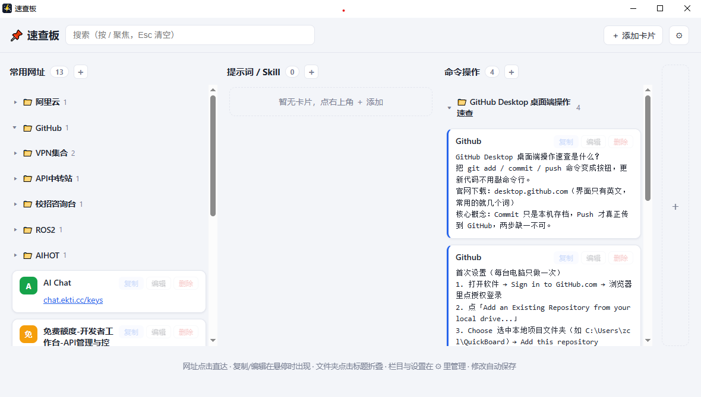

# QuickBoard 速查板



基于 **.NET 8 (WPF + WebView2)** 的 Windows 桌面速查板工具：以卡片面板集中管理常用网址与书签，支持关键词即时搜索和浏览器书签同步，界面跟随系统自动切换明暗主题。

## 功能特性

- 卡片式速查面板，顶部关键词即时过滤
- 浏览器书签同步（`BookmarkSyncService`），可开关、可手动立即同步
- 浅色 / 深色主题自适应（跟随系统 `prefers-color-scheme`）
- 界面为单文件本地 HTML（`wwwroot/index.html`），由 WebView2 承载

## 环境要求

- Windows 10 / 11
- [.NET 8 SDK](https://dotnet.microsoft.com/download/dotnet/8.0)
- Microsoft Edge WebView2 Runtime（Windows 11 一般已内置）

## 构建与运行

```bash
git clone https://github.com/<你的用户名>/QuickBoard.git
cd QuickBoard
dotnet build
dotnet run
```

## 发布

```bash
# 框架依赖发布（体积小，目标机器需安装 .NET 8 运行时）
dotnet publish -c Release -r win-x64

# 自包含单文件发布（无需安装运行时，体积较大）
dotnet publish -c Release -r win-x64 --self-contained true /p:PublishSingleFile=true
```

## 项目结构

```
QuickBoard.csproj        项目文件（net8.0-windows，WPF + WinForms + WebView2）
App.xaml / MainWindow    WPF 入口与主窗口（承载 WebView2）
BookmarkSyncService.cs   浏览器书签同步服务
wwwroot/index.html       本地 UI（速查板页面）
```
